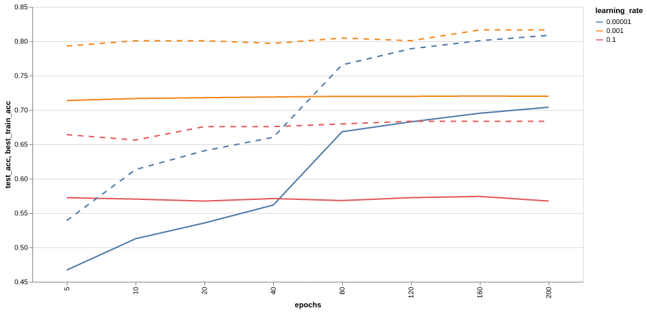

# Practical 1 (ddl20)

## Lab 1
### 1. What is the impact of varying batch sizes and why?

Varying the batch size will affect the convergence of the model during training.
The smaller the batch size, the quicker the model will converge during training.
This is because each batch can be computed quicker and updates to the model
parameters occur more frequently. However, too small of a batch might lead to
computational inefficiencies as modern hardware such as GPUs are able to load
and process many inputs in parallel at once. Another problem with small batches
is the noisiness of updates and the stability of training. If the batches are
too small, the model's parameters may update more erratically.

The graph below shows the training accuracy vs. the normalised training steps.
Normalised training steps means that the step we start training is assigned 0
and the step we stop training is 1. For these training runs, the number of
epochs was 10 and the learning rate was set to 0.001.


From the graph above we can verify that:
- Smaller batch size converges quicker to the final accuracy for these
parameters.
- Smaller batch size means more noisy updates and less stable validation
accuracy.

### 2. What is the impact of varying maximum epoch number?

Varying the maximum epoch will have implications on the under/overfitting of a
model as well as the training time. If the number of epochs is too small, the
model might not have been given enough time to learn from the data, which will
result in an underfitted model. On the contrary, if the number of epochs is too
large, then the model will start to overfit on the data. This will reduce the
model's ability to fit new data (generalisability) and negatively affect its
test accuracy.

The graph below shows the effect of epoch number on the training and test
accuracy. All configurations had a constant batch size of 256. The dotted lines
show the training accuracy and the solid lines show test accuracy.



The high learning rates don't converge in terms of training accuracy and stay
relatively constant when compared to the curve with learning rate 0.00001.
However for the curve with learning rate 0.00001, we can clearly see the effects
of low max epoch as the model underfits the data when compared to if it was
given more time to train on the dataset. One effect we don't observe is the test
accuracy inverting while the test accuracy is still high. This may happen when
the epoch is too high and the model overfits the training dataset and cannot
generalise as well to the test dataset.


### 3. What is happening with a large learning and what is happening with a small learning rate and why? What is the relationship between learning rates and batch sizes?

The learning rate controls the step size that the model parameters are updated.
This means that varying the learning rate will greatly affect the convergence
and stability of training.

We can see effects of learning rate is very similar to varying the batch size as
shown in Question 1. Both parameters will affect the stability, convergence,
and over/underfitting of a model. The interaction between them is that smaller
batch sizes may require smaller learning rates so that effects of a noisy
training batch will not make the parameter update overshoot the minima. On the
contrary, a larger batch size means less noisy updates so the model may be able
to tolerate larger learning rates to converge quicker.

The graph below shows the effect of varying the learning rate and batch size vs.
the test accuracy of the model after training for 10 epochs.


We can validate that larger batch sizes will perform better and with larger
learning rates and vice versa.

### 4. Implement a network that has in total around 10x more parameters than the toy network.

Implemented JSC-Medium network in [__init__.py](../machop/chop/models/physical/__init__.py)

### 5. Test your implementation and evaluate its performance.

...

## Lab 2
### 1. Explain the functionality of `report_graph_analysis_pass` and its printed jargons such as `placeholder`, `get_attr` ... You might find the doc of [torch.fx](https://pytorch.org/docs/stable/fx.html) useful.

`report_graph_analysis_pass` is an analysis pass in MASE that provides a short
summary of the model. An analysis pass means that it shouldn't change the graph.
It first prints out the entire torch `fx_graph` which is an IR that reprents the
basic building blocks of the model.

This is the output of `report_graph_analysis_pass`:

```
graph():
    %x : [num_users=1] = placeholder[target=x]
    %seq_blocks_0 : [num_users=1] = call_module[target=seq_blocks.0](args = (%x,), kwargs = {})
    %seq_blocks_1 : [num_users=1] = call_module[target=seq_blocks.1](args = (%seq_blocks_0,), kwargs = {})
    %seq_blocks_2 : [num_users=1] = call_module[target=seq_blocks.2](args = (%seq_blocks_1,), kwargs = {})
    %seq_blocks_3 : [num_users=1] = call_module[target=seq_blocks.3](args = (%seq_blocks_2,), kwargs = {})
    return seq_blocks_3
Network overview:
{'placeholder': 1, 'get_attr': 0, 'call_function': 0, 'call_method': 0, 'call_module': 4, 'output': 1}
Layer types:
[BatchNorm1d(16, eps=1e-05, momentum=0.1, affine=True, track_running_stats=True), ReLU(inplace=True), Linear(in_features=16, out_features=5, bias=True), ReLU(inplace=True)]
```

The documentation for what every node means is
[here](https://pytorch.org/docs/stable/fx.html#torch.fx.Node), but a short
summary of the ops that are printed above are presented here:

- `placeholder` is an `node.op` which represents an input to a function, the
target is the name of the variable. `placeholder` can also have `args` which
will denote the default value the placeholder will take. In this case we have no
default value.
- `call_module` is an op that applies the `forward()` of a module. The target is
the name of the module to apply and the `args` and `kwargs` are the arguments
to the function exactly like how it works in python.
- `output` is an op that captures the output in its `args[0]`. In this case, it
corresponds to the `return seq_blocks_3` statement.

Then the function iterates through the nodes in the graph to extract the module
it maps to from `MaseMetadata`. It will also iterate through the graph to find
the native torch fx ops to counts the number of each type of op in the graph.

### 2. What are the functionalities of `profile_statistics_analysis_pass` and `report_node_meta_param_analysis_pass` respectively?

`profile_statistics_analysis_pass` is an analysis pass which collects statistics
on any input port of a graph node. This can be either the `data_in_0`,
`weights` or `bias`. Which modules and inputs as well as what type of statistic
can all be customised via a configuration dict. All the different statistics are
in [stat.py](../machop/chop/passes/graph/analysis/statistical_profiler/stat.py).

`report_node_meta_param_analysis_pass` is an analysis pass which will generate a
tabulated report on meta parameters which are attached to each of the nodes in
the graph. These can either be some common, software, or hardware parameters
based on the config passed to the pass.

### 3. Explain why only 1 OP is changed after the `quantize_transform_pass`.

`quantize_transform_pass` checks the config dict for if the name of the layer
appears. It will only apply the quantization if it appears, otherwise, it uses
the default config which is passed in. In this lab, the config default has
`"name": None`, which indicates that the default is no quantization. This means
that only the linear layers are quantized, and since there is only 1 linear
layer in the graph, only 1 OP is quantized.

### 4. Write some code to traverse both `mg` and `ori_mg`, check and comment on the nodes in these two graphs. You might find the source code for the implementation of `summarize_quantization_analysis_pass` useful.

Created traverse graph flow [here](../machop/chop/passes/graph/analysis/traverse/traverse_graph.py).

The function traverses the graph and prints out the name of each node as well as
a bunch of MASE specific information such as type and op info, as well as
MaseMetadata parameters.

### 5. Perform the same quantisation flow to the bigger JSC network that you have trained in lab1. You must be aware that now the `pass_args` for your custom network might be different if you have used more than the `Linear` layer in your network.

### 6. Write code to show and verify that the weights of these layers are indeed quantised. You might need to go through the source code of the implementation of the quantisation pass and also the implementation of the [Quantized Layers](../../machop/chop/passes/transforms/quantize/quantized_modules/linear.py).

### 7. Load your own pre-trained JSC network, and perform perform the quantisation using the command line interface.
