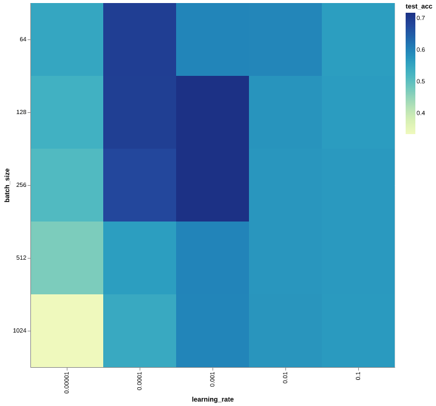

# Practical 1 (ddl20)

## Lab 1
### 1. What is the impact of varying batch sizes and why?

Varying the batch size will affect the convergence of the model during training.
The smaller the batch size, the quicker the model will converge during training.
This is because each batch can be computed quicker and updates to the model
parameters occur more frequently. However, too small of a batch might lead to
computational inefficiencies as modern hardware such as GPUs are able to load
and process many inputs in parallel at once. Another problem with small batches
is the noisiness of updates and the stability of training. If the batches are
too small, the model's parameters may update more erratically.

The graph below shows the training accuracy vs. the normalised training steps.
Normalised training steps means that the step we start training is assigned 0
and the step we stop training is 1. For these training runs, the number of
epochs was 10 and the learning rate was set to 0.001.

From the graph above we can verify that:
- Smaller batch size converges quicker to the final accuracy for these
parameters.
- Smaller batch size means more noisy updates and less stable validation
accuracy.

### 2. What is the impact of varying maximum epoch number?

Varying the maximum epoch will have implications on the under/overfitting of a
model as well as the training time. If the number of epochs is too small, the
model might not have been given enough time to learn from the data, which will
result in an underfitted model. On the contrary, if the number of epochs is too
large, then the model will start to overfit on the data. This will reduce the
model's ability to fit new data (generalisability) and negatively affect its
test accuracy.

COMMENT ABOUT LEARNING CURVE

### 3. What is happening with a large learning and what is happening with a small learning rate and why? What is the relationship between learning rates and batch sizes?

The learning rate controls the step size that the model parameters are updated.
This means that varying the learning rate will greatly affect the convergence
and stability of training.

We can see effects of learning rate is very similar to varying the batch size as
shown in Question 1. Both parameters will affect the stability, convergence,
and over/underfitting of a model. The interaction between them is that smaller
batch sizes may require smaller learning rates so that effects of a noisy
training batch will not make the parameter update overshoot the minima. On the
contrary, a larger batch size means less noisy updates so the model may be able
to tolerate larger learning rates to converge quicker.

### 4. Implement a network that has in total around 10x more parameters than the toy network.

Implemented JSC-Medium network in [__init__.py](../machop/chop/models/physical/__init__.py)

### 5. Test your implementation and evaluate its performance.

## Lab 2
### 1. Explain the functionality of `report_graph_analysis_pass` and its printed jargons such as `placeholder`, `get_attr` ... You might find the doc of [torch.fx](https://pytorch.org/docs/stable/fx.html) useful.

### 2. What are the functionalities of `profile_statistics_analysis_pass` and `report_node_meta_param_analysis_pass` respectively?

### 3. Explain why only 1 OP is changed after the `quantize_transform_pass`.

### 4. Write some code to traverse both `mg` and `ori_mg`, check and comment on the nodes in these two graphs. You might find the source code for the implementation of `summarize_quantization_analysis_pass` useful.

### 5. Perform the same quantisation flow to the bigger JSC network that you have trained in lab1. You must be aware that now the `pass_args` for your custom network might be different if you have used more than the `Linear` layer in your network.

### 6. Write code to show and verify that the weights of these layers are indeed quantised. You might need to go through the source code of the implementation of the quantisation pass and also the implementation of the [Quantized Layers](../../machop/chop/passes/transforms/quantize/quantized_modules/linear.py).

### 7. Load your own pre-trained JSC network, and perform perform the quantisation using the command line interface.
